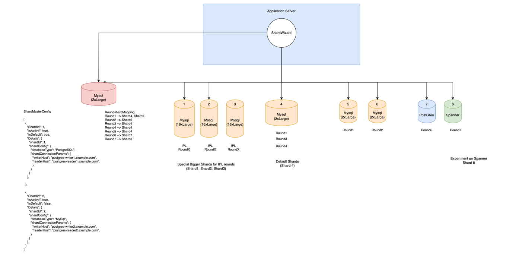

# ShardWizard

[](https://search.maven.org/artifact/com.dream11/shard-wizard)
[](https://openjdk.java.net/)
[](https://opensource.org/licenses/MIT)
[](https://github.com/dream11/shard-wizard/issues)
[](https://github.com/dream11/shard-wizard/stargazers)

A powerful, reactive Java library for managing database sharding in distributed systems with dynamic shard allocation, zero-downtime scaling, and comprehensive observability.

## 🎯 Overview

ShardWizard is designed to solve complex database sharding challenges in high-scale applications. Built on Vert.x, it provides a robust framework for managing multiple database shards with intelligent routing, automatic failover, and seamless scalability.

### Key Features

- **🔄 Dynamic Shard Management**: Add or remove shards without application downtime
- **🎯 Intelligent Routing**: Configurable modulo and consistent hashing strategies
- **🛡️ Fault Tolerance**: Built-in circuit breakers and automatic failover
- **📊 Multi-Database Support**: PostgreSQL, MySQL, DynamoDB, and S3 backends
- **📈 Observability**: Comprehensive metrics, tracing, and health monitoring
- **⚡ Reactive Architecture**: Non-blocking, asynchronous operations using RxJava
- **🏗️ Flexible Configuration**: Support for different shard configurations per entity
- **🔧 Easy Integration**: Simple DAO factory pattern for existing applications

### Use Cases

- **High-Traffic Applications**: Distribute load across multiple database instances
- **Multi-Tenant Systems**: Isolate tenant data on dedicated shards
- **Geographic Distribution**: Route requests to region-specific databases
- **Event-Based Systems**: Scale specific event types (e.g., IPL matches) on dedicated infrastructure
- **Microservices**: Manage data consistency across service boundaries

## 🏗️ Architecture



ShardWizard operates on a simple but powerful concept:
- **Entities** (e.g., tournaments, users) are mapped to one or more **Shards**
- **Route Keys** determine which shard handles specific requests
- **Default Shards** handle new entities automatically
- **Special Entities** can be configured on dedicated shards for isolation

## 📊 Database Support

### Shard Master Storage

ShardWizard supports multiple backends for storing shard management metadata:

| Storage Type | Status | Description | Use Case |
|-------------|--------|-------------|----------|
| **PostgreSQL** | ✅ Stable | Relational database with JSONB support | Production environments requiring ACID compliance |
| **MySQL** | ✅ Stable | Relational database with JSON support | MySQL-native applications |
| **DynamoDB** | ✅ Stable | NoSQL serverless database | Cloud-native, serverless deployments |
| **S3** | ✅ Stable | Object storage with JSON files | Configuration-as-code, GitOps workflows |

### Data Shard Support

Individual shards can use any of these database technologies:

| Database | Client Type | Status | Description |
|----------|-------------|--------|-------------|
| **PostgreSQL** | Vert.x Reactive | ✅ Stable | High-performance reactive client |
| **PostgreSQL** | HikariCP | ✅ Stable | Traditional connection pool based |
| **MySQL** | Vert.x Reactive | ✅ Stable | MySQL with reactive driver |
| **DynamoDB** | AWS SDK | ✅ Stable | NoSQL key-value and document database |

## 🚀 Quick Start

### Prerequisites

- Java 11 or higher
- Maven 3.6+
- One of the supported shard master storage systems

### Installation

Add the dependency to your `pom.xml`:

```xml
<dependency>
    <groupId>com.dream11</groupId>
    <artifactId>shard-wizard</artifactId>
    <version>x.y.z</version>
</dependency>
```

### Configuration

ShardWizard supports multiple configuration approaches with intelligent fallback:

#### Database-Specific Configuration (Recommended)

Create database-specific configuration files:

**`src/main/resources/config/shard-manager/postgres.conf`:**
```hocon
sourceType = "POSTGRES"
shardsRefreshSeconds = 60
routerType = "MODULO"  # Options: MODULO, CONSISTENT
serviceName = "my-service"

sources = {
  POSTGRES {
    type = "POSTGRES"
    writerHost = "localhost"
    readerHost = "localhost"
    port = 5432
    database = "shardmaster"
    username = "postgres"
    password = "password"
    
    databaseDefaultShardConfigMap = {
      POSTGRES {
        database = "app_shard"
        username = "app_user"
        password = "app_password"
        maxConnections = 10
        circuitBreaker {
          enabled = true
          failureRateThreshold = 50
          waitDurationInOpenState = 30000
        }
      }
    }
  }
}
```

**`src/main/resources/config/shard-manager/s3.conf`:**
```hocon
sourceType = "S3"
shardsRefreshSeconds = 60
routerType = "CONSISTENT"  # Options: MODULO, CONSISTENT
serviceName = "my-service"

sources = {
  S3 {
    type = "S3"
    bucketName = "my-shard-config-bucket"
    shardMasterFilePath = "shard-master.json"
    entityShardMappingFolderPath = "entity-mappings/"
    region = "us-east-1"
    accessKey = ""  # Use IAM roles
    secretKey = ""  # Use IAM roles
    endpointOverride = ""  # For LocalStack testing
    forcePathStyle = false
    
    databaseDefaultShardConfigMap = {
      POSTGRES {
        database = "app_shard"
        username = "app_user" 
        password = "app_password"
        maxConnections = 10
        circuitBreaker {
          enabled = true
          failureRateThreshold = 50
          waitDurationInOpenState = 30000
        }
      }
    }
  }
}
```

#### Universal Fallback Configuration

Create a fallback configuration at `src/main/resources/config/shard-manager/default.conf`:

```hocon
sourceType = "POSTGRES"  # Default fallback type
shardsRefreshSeconds = 60
routerType = "MODULO"  # Default router type
serviceName = "my-service"

# Contains configurations for ALL supported database types
sources = {
  POSTGRES {
    type = "POSTGRES"
    writerHost = "localhost"
    readerHost = "localhost"
    port = 5432
    database = "shardmaster"
    username = "postgres"
    password = "password"
    databaseDefaultShardConfigMap = { /* ... */ }
  }
  
  S3 {
    type = "S3"
    bucketName = "my-shard-config-bucket"
    shardMasterFilePath = "shard-master.json"
    entityShardMappingFolderPath = "entity-mappings/"
    region = "us-east-1"
    databaseDefaultShardConfigMap = { /* ... */ }
  }
  
  MYSQL {
    type = "MYSQL"
    writerHost = "localhost"
    readerHost = "localhost"
    port = 3306
    database = "shardmaster"
    username = "mysql"
    password = "mysql"
    databaseDefaultShardConfigMap = { /* ... */ }
  }
  
  DYNAMO {
    type = "DYNAMO"
    region = "us-east-1"
    endpointOverride = "http://localhost:8000"
    databaseDefaultShardConfigMap = { /* ... */ }
  }
}
```

#### Configuration Priority

1. **Database-specific config**: `postgres.conf`, `s3.conf`, `mysql.conf`, `dynamo.conf`
2. **Fallback**: `default.conf`
3. **System property**: `-Dshard.source.type=POSTGRES`

#### Configuration Options

| Option | Type | Default | Description |
|--------|------|---------|-------------|
| `sourceType` | String | Required | Database type for shard master storage (`POSTGRES`, `MYSQL`, `S3`, `DYNAMO`) |
| `routerType` | String | `MODULO` | Routing strategy (`MODULO`, `CONSISTENT`) |
| `shardsRefreshSeconds` | Integer | `60` | Frequency of shard configuration refresh |
| `serviceName` | String | Required | Service name for metrics and logging |
| `metricsAgent` | String | `noop` | Observability provider (`datadog`, `newrelic`, `noop`) |

**Router Type Details:**
- **`MODULO`**: Perfect distribution for numeric route keys, ideal for high-performance scenarios
- **`CONSISTENT`**: Consistent hashing for minimal data movement during scaling, ideal for dynamic environments

## 🗄️ Shard Master Setup

### PostgreSQL Setup

```sql
-- Create shard management tables
CREATE TABLE ShardMaster (
    ShardId   SERIAL PRIMARY KEY,
    IsActive  BOOLEAN      NOT NULL DEFAULT true,
    IsDefault BOOLEAN      NOT NULL DEFAULT false,
    Details   varchar(512) NOT NULL,
    CreatedAt TIMESTAMP    NOT NULL DEFAULT CURRENT_TIMESTAMP,
    UpdatedAt TIMESTAMP             DEFAULT CURRENT_TIMESTAMP
);

CREATE TABLE EntityShardMapping (
    EntityId  VARCHAR(255) PRIMARY KEY,
    ShardIds  JSONB     NOT NULL,
    CreatedAt TIMESTAMP NOT NULL DEFAULT CURRENT_TIMESTAMP,
    UpdatedAt TIMESTAMP          DEFAULT CURRENT_TIMESTAMP
);

-- Sample data
INSERT INTO ShardMaster (IsActive, IsDefault, Details)
VALUES (true, true, 
        '{"databaseType": "POSTGRES", "shardConnectionParams": {"port": 5432, "readerHost": "localhost", "writerHost": "localhost", "maxConnections": 10}}');
```

### MySQL Setup

```sql
-- Create shard management tables
CREATE TABLE ShardMaster (
    ShardId   INT AUTO_INCREMENT PRIMARY KEY,
    IsActive  BOOLEAN  NOT NULL DEFAULT true,
    IsDefault BOOLEAN  NOT NULL DEFAULT false,
    Details   JSON     NOT NULL,
    CreatedAt DATETIME NOT NULL DEFAULT CURRENT_TIMESTAMP,
    UpdatedAt DATETIME DEFAULT CURRENT_TIMESTAMP ON UPDATE CURRENT_TIMESTAMP
);

CREATE TABLE EntityShardMapping (
    EntityId  VARCHAR(255) PRIMARY KEY,
    ShardIds  JSON     NOT NULL,
    CreatedAt DATETIME NOT NULL DEFAULT CURRENT_TIMESTAMP,
    UpdatedAt DATETIME DEFAULT CURRENT_TIMESTAMP ON UPDATE CURRENT_TIMESTAMP
);

-- Sample data  
INSERT INTO ShardMaster (IsActive, IsDefault, Details)
VALUES (true, true, 
        '{"databaseType": "MYSQL", "shardConnectionParams": {"port": 3306, "readerHost": "localhost", "writerHost": "localhost", "maxConnections": 10}}');
```

### DynamoDB Setup

```bash
# Create ShardMaster table
aws dynamodb create-table \
    --table-name ShardMaster \
    --attribute-definitions AttributeName=shardId,AttributeType=N \
    --key-schema AttributeName=shardId,KeyType=HASH \
    --billing-mode PAY_PER_REQUEST

# Create EntityShardMapping table  
aws dynamodb create-table \
    --table-name EntityShardMapping \
    --attribute-definitions AttributeName=entityId,AttributeType=S \
    --key-schema AttributeName=entityId,KeyType=HASH \
    --billing-mode PAY_PER_REQUEST
```

Sample DynamoDB shard configuration:
```json
{
  "shardId": 1,
  "details": {
    "databaseType": "POSTGRES",
    "shardConnectionParams": {
      "writerHost": "localhost",
      "readerHost": "localhost", 
      "port": 5432,
      "maxConnections": 10
    }
  },
  "default": true,
  "active": true
}
```

### S3 Setup

Create JSON files in your S3 bucket:

**shard-master.json:**
```json
[
  {
    "shardId": 1,
    "details": {
      "databaseType": "POSTGRES",
      "shardConnectionParams": {
        "writerHost": "localhost",
        "readerHost": "localhost",
        "port": 5432,
        "maxConnections": 10
      }
    },
    "default": true,
    "active": true
  }
]
```

**entity-mappings/entity_001.json:**
```json
{
  "entityId": "tournament_001",
  "shardIds": [1, 2]
}
```

Configuration for S3 (add to your `s3.conf`):
```hocon
sourceType = "S3"
sources = {
  S3 {
    type = "S3"
    bucketName = "my-shard-config-bucket"
    shardMasterFilePath = "shard-master.json"
    entityShardMappingFolderPath = "entity-mappings/"
    region = "us-east-1"
    accessKey = ""  # Use IAM roles
    secretKey = ""  # Use IAM roles
    endpointOverride = ""  # For LocalStack
    forcePathStyle = false
  }
}
```

## 💻 Implementation

### 1. Define Your DAO Interface

```java
public interface OrderDao {
    Single<String> create(OrderDto orderDto);
    Single<OrderDto> get(String orderId);
    Single<Boolean> update(OrderDto orderDto);
}
```

### 2. Implement DAO Factory

```java
public class OrderDaoFactory extends AbstractDaoFactory<OrderDao> {

    // Legacy constructor for backward compatibility (uses intelligent fallback)
    @Deprecated
    public OrderDaoFactory(Vertx vertx) {
        super(vertx);
    }
    
    // Recommended constructor with explicit DatabaseType
    public OrderDaoFactory(Vertx vertx, DatabaseType sourceType) {
        super(vertx, sourceType);
    }

    @Override
    protected OrderDao getDaoImplFromType(ShardDetails shardDetails) {
        DatabaseType databaseType = shardDetails.getShardConfig().getDatabaseType();
        switch (databaseType) {
            case POSTGRES:
                return new PostgresOrderDaoImpl(vertx, shardDetails);
            case MYSQL:
                return new MySqlOrderDaoImpl(vertx, shardDetails);
            case DYNAMO:
                return new DynamoOrderDaoImpl(vertx, shardDetails);
            default:
                throw new IllegalArgumentException("Unsupported database type: " + databaseType);
        }
    }

    @Override
    protected long getShardIdFromPrimaryKey(String primaryKey) {
        // Extract shard ID from format "ORD-001-uuid"
        return Long.parseLong(primaryKey.split("-")[1]);
    }
}
```

### 3. Implement DAO

```java
public class PostgresOrderDaoImpl extends PostgresBaseDao implements OrderDao {

    public PostgresOrderDaoImpl(Vertx vertx, ShardDetails shardDetails) {
        super(vertx, shardDetails);
    }

    @Override
    public Single<String> create(OrderDto orderDto) {
        String orderId = generateOrderId();
        return postgresVertxClient
            .rxExecutePreparedQuery(RdsCluster.WRITER,
                "INSERT INTO orders(order_id, order_name, user_id) VALUES($1, $2, $3)",
                Tuple.of(orderId, orderDto.getOrderName(), orderDto.getUserId()))
            .map(result -> orderId);
    }

    @Override
    public Single<OrderDto> get(String orderId) {
        return postgresVertxClient
            .rxExecutePreparedQuery(RdsCluster.READER,
                "SELECT * FROM orders WHERE order_id = $1",
                Tuple.of(orderId))
            .map(this::mapToOrderDto);
    }
}
```

### 4. Bootstrap Application

#### Option A: With Explicit DatabaseType (Recommended)

```java
public class Application {
    
    public static void main(String[] args) {
        Vertx vertx = Vertx.vertx();
        
        // Explicit database type - loads postgres.conf
        OrderDaoFactory factory = new OrderDaoFactory(vertx, DatabaseType.POSTGRES);
        
        factory.rxBootstrap()
            .subscribe(
                () -> log.info("ShardWizard started successfully"),
                error -> log.error("Failed to start", error)
            );
    }
}
```

#### Option B: Using System Property

```java
public class Application {
    
    public static void main(String[] args) {
        // Set system property to control database type
        System.setProperty("shard.source.type", "S3");
        
        Vertx vertx = Vertx.vertx();
        OrderDaoFactory factory = new OrderDaoFactory(vertx, DatabaseType.S3);
        
        factory.rxBootstrap()
            .subscribe(
                () -> log.info("ShardWizard started successfully"),
                error -> log.error("Failed to start", error)
            );
    }
}
```

#### Option C: Legacy Approach (Backward Compatible)

```java
public class Application {
    
    public static void main(String[] args) {
        Vertx vertx = Vertx.vertx();
        
        // Uses intelligent fallback: system property → default.conf → POSTGRES
        OrderDaoFactory factory = new OrderDaoFactory(vertx);
        
        factory.rxBootstrap()
            .subscribe(
                () -> log.info("ShardWizard started successfully"), 
                error -> log.error("Failed to start", error)
            );
    }
}
```

### 5. Usage in Service

```java
@Service
public class OrderService {
    
    @Inject OrderDaoFactory orderDaoFactory;
    
    public Single<String> createOrder(String entityId, OrderDto orderDto) {
        return orderDaoFactory
            .rxGetOrCreateEntityShardDao(entityId, orderDto.getUserId())
            .flatMap(dao -> dao.create(orderDto));
    }
    
    public Single<OrderDto> getOrder(String orderId) {
        return orderDaoFactory
            .rxGetDaoInstanceByPrimaryKey(orderId)
            .flatMap(dao -> dao.get(orderId));
    }
}
```

### 6. Dependency Injection Setup (Optional)

#### Guice Configuration

```java
public class MainModule extends AbstractModule {
    
    private final DatabaseType databaseType;
    
    public MainModule() {
        this(null); // Uses intelligent fallback
    }
    
    public MainModule(DatabaseType databaseType) {
        this.databaseType = databaseType;
    }

    @Override
    protected void configure() {
        bind(OrderDaoFactory.class).toProvider(OrderDaoFactoryProvider.class).in(Singleton.class);
    }

    @Provides
    @Singleton
    public Vertx provideVertx() {
        return Vertx.vertx();
    }

    @Provides
    @Singleton
    public DatabaseType provideDatabaseType() {
        return ShardManagerConfigLoader.resolveDatabaseType(databaseType);
    }
}
```

#### Factory Provider

```java
public class OrderDaoFactoryProvider implements Provider<OrderDaoFactory> {

    @Inject Vertx vertx;
    
    // Optional injection - for backward compatibility
    @Inject(optional = true) DatabaseType sourceType;

    @Override
    public OrderDaoFactory get() {
        if (sourceType != null) {
            return new OrderDaoFactory(vertx, sourceType);
        } else {
            return new OrderDaoFactory(vertx); // Uses fallback
        }
    }
}
```

#### Usage

```java
// With explicit database type
AppContext.initialize(new MainModule(DatabaseType.POSTGRES));

// With fallback mechanism
AppContext.initialize(new MainModule());

// Get factory instance
OrderDaoFactory factory = AppContext.getInstance(OrderDaoFactory.class);
```

## 📊 Observability

### Monitoring Providers

| Provider | Status | Description |
|----------|--------|-------------|
| **Datadog** | ✅ Stable | StatsD-based metrics and events |
| **New Relic** | ✅ Stable | APM and infrastructure monitoring |
| **Custom** | ✅ Stable | Implement your own `ObservabilityAdapter` |
| **No-Op** | ✅ Stable | Disabled monitoring for development |

### Basic Metrics

```java
// Record database events
DatabaseEventRecorder.getInstance()
    .recordSuccess(Constants.Metric.DB_QUERY, RdsCluster.WRITER, "INSERT INTO orders");

// Custom metrics with execution time
DatabaseEventRecorder.getInstance().recordEvent(
    AdvancedDatabaseEventBuilder.create()
        .eventName(Constants.Metric.DB_QUERY)
        .executionTime(150L)
        .addCustomTag("shard_id", "3")
        .build()
);
```

### Configure Monitoring

```java
ObservabilityConfig config = ObservabilityConfig.builder()
    .provider("datadog")  // datadog, newrelic, or noop
    .serviceName("my-service")
    .datadogConfig(DatadogConfig.builder()
        .host("localhost")
        .port(8125)
        .build())
    .build();

ObservabilityServiceFactory.setConfiguration(config);
```

## 🔧 Advanced Features

### ShardManagerClient

```java
// Option 1: With explicit configuration (recommended)
ShardManagerConfig config = ShardManagerConfigLoader.loadConfigWithFallback(DatabaseType.POSTGRES);
ShardManagerClient shardManager = ShardManagerClient.create(vertx, config);

// Option 2: Legacy approach (uses fallback)
ShardManagerClient shardManager = ShardManagerClient.create(vertx);
```

### Routing Strategies

ShardWizard provides two built-in routing strategies that can be configured per deployment:

#### Modulo Routing (`MODULO`)

```hocon
routerType = "MODULO"
```

**Characteristics:**
- Uses modulo operation: `shardId = routeKey % totalShards`
- **Perfect distribution** for sequential numeric keys
- **Fast performance** - O(1) routing decisions
- **Best for:** Numeric IDs, sequential data, high-performance requirements

**Use Cases:**
- Auto-incrementing primary keys
- User IDs, order IDs, transaction IDs
- Applications requiring perfect load distribution

#### Consistent Hashing (`CONSISTENT`)

```hocon
routerType = "CONSISTENT"
```

**Characteristics:**
- Uses consistent hashing with virtual nodes
- **Resilient to shard changes** - minimal data movement when adding/removing shards
- **Good distribution** for string-based keys
- **Best for:** Dynamic scaling, string-based route keys, hash-based workloads

**Use Cases:**
- Username-based routing
- UUID-based keys
- Applications requiring frequent scaling operations
- Multi-tenant systems with tenant-based routing

#### Comparison

| Feature | MODULO | CONSISTENT |
|---------|---------|------------|
| **Distribution Quality** | Perfect for numeric keys | Good for all key types |
| **Performance** | Fastest (O(1)) | Fast (O(log n)) |
| **Scaling Impact** | High - requires data migration | Low - minimal data movement |
| **Memory Usage** | Minimal | Higher (virtual nodes) |
| **Best Route Keys** | Numeric IDs | Any string format |

### Custom Routing

For advanced use cases, you can implement custom routing logic by extending the `AbstractDaoFactory`:

```java
public class CustomOrderDaoFactory extends AbstractDaoFactory<OrderDao> {
    
    @Override
    protected ShardRouter getShardRouter() {
        // Option 1: Use configuration-driven routing (recommended)
        return ShardRouterFactory.createRouter(shardManagerConfig.getRouterType());
        
        // Option 2: Custom implementation
        return new ShardRouter() {
            @Override
            public void initialize(List<Long> shardIds) {
                this.shardIds = shardIds;
            }
            
            @Override
            public long getRoutedShardId(String routeKey) {
                // Your custom routing logic
                return customRoutingLogic(routeKey);
            }
        };
    }
}
```

#### Configuration Override Example

```java
// Override router type programmatically if needed
public class CustomOrderDaoFactory extends OrderDaoFactory {
    public CustomOrderDaoFactory(Vertx vertx, DatabaseType sourceType) {
        super(vertx, sourceType);
        // Configuration is already loaded via parent constructor
    }
    
    @Override
    protected ShardRouter getShardRouter() {
        // Force consistent routing regardless of configuration
        return ShardRouterFactory.createRouter(RouterType.CONSISTENT);
    }
}
```

### Dynamic Shard Management

```java
// Load configuration explicitly
ShardManagerConfig config = ShardManagerConfigLoader.loadConfigWithFallback(DatabaseType.POSTGRES);
ShardManagerClient shardManager = ShardManagerClient.create(vertx, config);

// Add new shard at runtime
ShardConfig newShard = ShardConfig.builder()
    .databaseType(DatabaseType.POSTGRES)
    .shardConnectionParams(/* connection params */)
    .build();

shardManager.rxRegisterNewShard(true, newShard)
    .subscribe(shardDetails -> log.info("New shard added: {}", shardDetails.getShardId()));
```


### Backward Compatibility

Existing code continues to work unchanged. New constructor with explicit `DatabaseType` is recommended for better control.

## 🤝 Contributing

We welcome contributions! Here's how you can help:

1. **🐛 Report Bugs**: Use our [issue tracker](https://github.com/dream11/shard-wizard/issues/new?template=bug_report.md)
2. **💡 Request Features**: Submit feature requests [here](https://github.com/dream11/shard-wizard/issues/new?template=feature_request.md)
3. **📝 Improve Documentation**: Help us improve our docs
4. **🔧 Submit Code**: Fork the repo and submit a pull request

### Development Setup

1. Fork the repository
2. Clone your fork: `git clone https://github.com/yourusername/shard-wizard.git`
3. Install dependencies: `mvn clean install`
4. Run tests: `mvn test`
5. Make your changes and submit a pull request

### Code Style

- Follow [Google Java Style Guide](https://google.github.io/styleguide/javaguide.html)
- Ensure all tests pass
- Add tests for new features
- Update documentation as needed

## 📋 Requirements

- **Java**: 11 or higher
- **Build Tool**: Maven 3.6+
- **Runtime**: Vert.x 3.9.2
- **Dependencies**: RxJava 2, HikariCP, AWS SDK

## 📄 License

This project is licensed under the MIT License - see the [LICENSE.md](LICENSE.md) file for details.

```
MIT License

Copyright (c) 2025 Dream Sports Labs

Permission is hereby granted, free of charge, to any person obtaining a copy
of this software and associated documentation files (the "Software"), to deal
in the Software without restriction, including without limitation the rights
to use, copy, modify, merge, publish, distribute, sublicense, and/or sell
copies of the Software, and to permit persons to whom the Software is
furnished to do so, subject to the following conditions:

The above copyright notice and this permission notice shall be included in all
copies or substantial portions of the Software.
```

## 🆘 Support

- **📋 Issues**: [GitHub Issues](https://github.com/dream11/shard-wizard/issues)

## 📈 Project Status

- **Development Status**: Active development
- **Production Ready**: ✅ Yes
- **Stability**: Stable
- **Performance**: Production-tested with millions of requests daily

## 🏆 Acknowledgments

- **Dream11 Engineering Team**: Core development and maintenance
- **Vert.x Community**: For the excellent reactive toolkit
- **RxJava Team**: For reactive extensions for the JVM
- **Contributors**: Thank you to all our [contributors](https://github.com/dream11/shard-wizard/contributors)

---

**Built with ❤️ by [Dream11](https://www.dream11.com) Engineering Team**

Used in production to handle millions of requests daily across multiple database shards.
